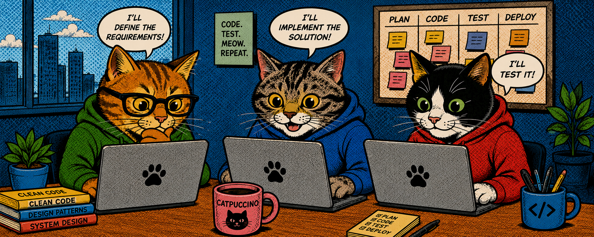

# Clowder

> # clowder <small>*(noun)*</small>
>
> <kbd>plural</kbd>&ensp;**-s**
>
> : a group of cats

**Clowder** combines a local development methodology with a thin Codex launcher. It coordinates a group of Agents (including a **Product Manager**, an **Architect**, a **Developer**, a **Tester**, and a **Reviewer**) via an **Orchestrator** to work around **1 Feature at a time**, while Jira, Git, pull requests, CI, and versioned artifacts remain the **durable sources of truth** and the user remains as the **Human-in-the-Loop (HITL)**.



The current implementation provides the project contract, role definitions, artifact templates, schemas, deterministic feature setup and validation scripts, and fixture-driven checks. Clowder itself is kept as a **working directory** during development. Validation runs against a **separate consumer repository**.

## Install Clowder

Install **Node.js** before installing Clowder.

Install the **pinned Node.js runtime dependencies**, 5 role definitions, 3 native Clowder skills, and 16 bundled upstream skills into the user Codex directory, after reviewing the proposed changes:

```sh
scripts/install.sh --codex-home /absolute/path/to/.codex
```

The 16 upstream skills are authored by **Matt Pocock** and sourced from the [Matt Pocock Skills Repository](https://github.com/mattpocock/skills). Clowder packages an **integrity-locked snapshot** under the upstream MIT License. See [Third-Party Notices](THIRD_PARTY_NOTICES.md).

Review and add the `Clowder` alias printed by the installer.

## Set Up a Product Repository

Run onboarding from the Clowder directory:

```sh
scripts/onboard.sh \
  --repo /absolute/path/to/product \
  --name "Product Name" \
  --jira-project ABC \
  --base-branch main
```

Onboarding installs the versioned Clowder pre-push guard and configures the consumer clone to **reject direct base-branch updates**. `scripts/doctor.sh` verifies this local guard. Configured review evidence, CI evidence, the **Ready for Merge gate**, its durable pull-request receipt, and **HITL** remain mandatory because the local guard is bypassable. `scripts/jira-mutate.sh` validates, records, applies, rereads, and receipts Jira card creation, metadata editing, linked-parent replacement, Lifecycle Phase changes, and Status handoffs with safe retry behavior.

Complete the generated `.clowder/project.yaml` with the Jira board name, GitHub repository, approval owners, quality commands, required CI checks, and any project-specific risk rules.

### Jira Requirements

Create or configure the Jira project and board manually with these exact Clowder requirements:

- **Work types:** `Stage`, `Epic`, `Feature`, `Subfeature`, and `Bug`.
- **Statuses and same-named board columns, in order:** `To Do`, `Product Manager`, `Architect`, `Developer`, `Tester`, `Reviewer`, and `Done`.
- **Status Categories:** `To Do` uses `To Do`, the 5 role Statuses use `In Progress`, and `Done` uses `Done`.
- **Native Parent:** every Epic, Feature, Subfeature, and Bug directly names the same Stage as its Jira Parent.
- **Linked work-item relation:** `Child`, with reciprocal labels `is parent of` and `is child of`.
- **Linked hierarchy:** Epic → Feature → Subfeature → Bug. Each child has at most 1 linked parent. A Bug belongs to a Subfeature.
- **Lifecycle Phase field:** Jira's native `Labels` field. It must be visible and editable. Clowder uses exactly 1 label per card and does not require a custom Lifecycle Phase field. For example, Development uses `Development`, while Ready for Development uses `Ready-for-Development`.
- **Permissions:** the connected Jira identity can browse the project, search, create, edit, link, transition, and comment on work items, including editing Parent and Labels.

The **board name and Jira project key must match** `.clowder/project.yaml`. Clowder operates on **Jira Status rather than board columns**. Jira maps every Status to its same-named column. Additional Jira views do not affect Clowder.

Set `jira.integration` to `acli`, authenticate ACLI, then verify Labels access and full readiness:

```sh
scripts/verify-jira-lifecycle-labels.sh ABC
scripts/doctor.sh --repo /absolute/path/to/product
```

Doctor validates the configured contract, live Jira project access, canonical Statuses, work types, and Labels access. Board-column mappings and Status Categories remain Jira-managed configuration and must match the checklist above.

Project, Feature, and handoff documents are evaluated through the Ajv version pinned in `package-lock.json`.

From the onboarded product repository, run:

```sh
Clowder
```

For local validation without external integrations:

```sh
scripts/doctor.sh --repo /path/to/consumer --offline
scripts/start-feature.sh --repo /path/to/consumer JIRA-123 feature-name --dry-run
```

When Feature setup reports an existing branch, worktree, or artifact directory, inspect it without mutation:

```sh
scripts/recover-feature.sh --repo /path/to/consumer --json JIRA-123 feature-name
```

The classifier reports the durable state and exact preservation-first repair actions. It **does not change Git or the filesystem**.

All Jira work-type, Parent, linked-hierarchy, Lifecycle Phase, Status, ownership, and handoff rules live in `JIRA_RULES.md`. The Orchestrator requires `scripts/jira-mutate.sh` for **every supported Jira write** and rejects a mutation or handoff without its **verified receipt**.

## Develop Clowder

Development-only architecture, tests, fixtures, validation tooling, and toolchain pins live under `dev/`. See [Clowder Architecture](dev/ARCHITECTURE.md) for the current system design.

Install the pinned development tools on macOS:

```sh
brew install shellcheck bats-core
```

Install Node.js dependencies and run the complete regression suite:

```sh
npm ci
dev/scripts/validate.sh
```
